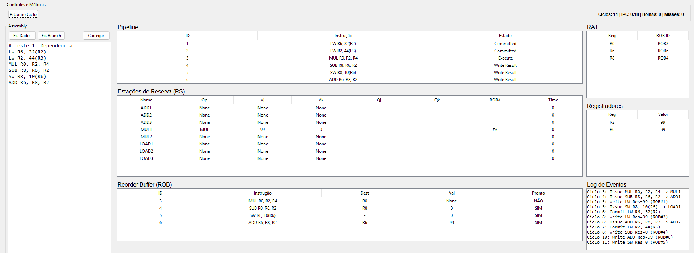

# Simulador Visual do Algoritmo de Tomasulo com ROB

Um simulador educacional interativo para arquiteturas superescalares que implementa o Algoritmo de Tomasulo estendido com Buffer de Reordenamento (ROB). Desenvolvido para auxiliar no ensino de Arquitetura de Computadores Avançada.


> *Visão geral da interface gráfica do simulador.*

---

## ✨ Funcionalidades

* **Execução Passo a Passo (Cycle-by-Cycle):** Visualize o despacho (Issue), execução, escrita (Write Result) e graduação (Commit) de cada instrução.
* **Pipeline Visual:** Tabelas dinâmicas para acompanhar o estado do processador:
    * **Fila de Instruções:** (Instruction Queue)
    * **Estações de Reserva:** Campos `V_j`, `V_k`, `Q_j`, `Q_k`.
    * **Reorder Buffer (ROB):** Com controle visual de ponteiros Head/Tail.
    * **RAT (Register Alias Table):** Para visualização da renomeação de registradores.
    * **Banco de Registradores:** Estado arquitetural.
* **Suporte a MIPS:** Editor integrado que aceita instruções MIPS padrão (`LW`, `SW`, `ADD`, `MUL`, `BEQ`, etc.).
* **Tratamento de Hazards:** Resolução automática de dependências RAW, WAR e WAW.
* **Especulação:** Suporte básico a desvio condicional com Flush em caso de erro de predição.

---

## 🛠️ Pré-requisitos

Para rodar este simulador, você precisa ter o **Python 3** instalado.

A interface gráfica utiliza a biblioteca `tkinter`, que geralmente já vem instalada com o Python no Windows e macOS.

### Linux (Debian/Ubuntu/Kali/Mint)
No Linux, pode ser necessário instalar o pacote separadamente:

```bash
sudo apt update
sudo apt install python3-tk
